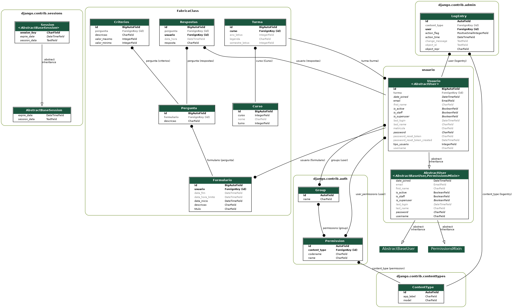

# fabricaClass

## Aplicação Web para Avaliação da Qualidade do Ensino no IFC.

Diagrama do Projeto: 




# Para subir a aplicação utilize os seguintes comandos 

```shell
docker componse up 
```
Após o docker subir e o novo banco postgres se formar é só fazer a migração e executar a aplicação

```shell
pdm run python manage.py migrate
```

```shell
pdm run python manage.py runserver
```